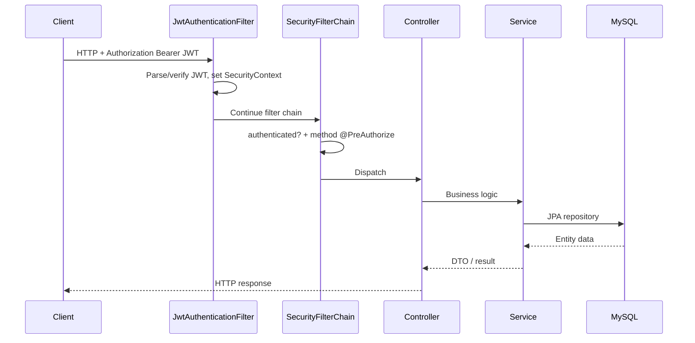

# Nerya All Naturals — Current Implementation, Flow & Vulnerabilities

> **Purpose:** Documentation-only snapshot of the project's current implementation and security findings.  
> **Location:** `project-docs/` — isolated from `src/`, Gradle build, Docker, and runtime. Does not affect application processes.  
> **Generated:** 2026-07-08  
> **Scope:** As implemented in the repository at documentation time.

---

## 1. Project overview

**Nerya All Naturals** is a Spring Boot e-commerce backend for natural products. Current maturity covers authentication, users, product catalog, categories, and admin inventory. Orders, cart, checkout, payments, email, and customer-facing storefront APIs are **not** implemented yet.

| Item | Value |
|------|--------|
| Group / artifact | `com.nerya` / `nerya-all-naturals` |
| Description | E-commerce platform for Nerya All Naturals |
| Language | Java 21 |
| Framework | Spring Boot **3.3.4** |
| Build | Gradle (wrapper), dependency-management **1.1.6** |
| Database | MySQL via Spring Data JPA |
| Auth | Stateless JWT (JJWT **0.12.6**) |
| API docs | springdoc-openapi **2.6.0** |
| Default port | **8081** (`application.yml`) |

---

## 2. Tech stack

| Layer | Technology |
|-------|------------|
| Web / REST | `spring-boot-starter-web` |
| Security | `spring-boot-starter-security` + custom JWT filter |
| Persistence | `spring-boot-starter-data-jpa` + `mysql-connector-j` |
| Validation | `spring-boot-starter-validation` |
| Monitoring | `spring-boot-starter-actuator` (`health`, `info`) |
| Migrations | Flyway on classpath — **no migration scripts present** |
| Utilities | Lombok |
| Tests (declared) | spring-boot-starter-test, Testcontainers MySQL — **no test sources found** |

---

## 3. Package structure

Root package: `com.nerya.neryaallnaturals`

```
com.nerya.neryaallnaturals
├── NeryaAllNaturalsApplication.java
├── annotation/          # @AdminOnly, @CustomerOnly, @UserOnly, @AdminOrUser, @AdminOrCustomer, @Authenticated
├── config/              # SecurityConfig, OpenApiConfig
├── controller/          # Auth, User, Product, Category, Inventory
├── dto/                 # Request / response DTOs
├── entity/              # JPA entities (+ BaseEntity)
├── filter/              # JwtAuthenticationFilter
├── repository/          # Spring Data JPA repositories
├── service/             # Auth, User, Product, Category, Inventory
├── util/                # JwtUtil
└── web/                 # HealthController
```

**Layering notes:**
- Most domains use Controller → Service → Repository.
- `UserController` calls `UserRepository` and `PasswordEncoder` **directly** (bypasses `UserService` for CRUD).
- Entities exist for `Customer`, `Address`, `ProductReview` with repositories but **no HTTP controllers/services**.
- No dedicated `exception/` package or global `@ControllerAdvice`.

---

## 4. Data model

```
BaseEntity (id, createdAt, updatedAt)
    │
User ──<<element collection>>── user_roles (ROLE_USER | ROLE_ADMIN | ROLE_CUSTOMER)
    │
    └── (intended) 1:1 ── Customer
                            └── customerId (Long, no JPA @ManyToOne) ── Address

Category ──1:N── Category (parent / subcategories)
    └──1:N── Product
                ├──1:N── ProductImage
                ├──1:N── ProductReview (customerId Long, denormalized)
                ├──<<tags>>── product_tags
                └──1:1── Inventory
```

**Implied tables:** `users`, `user_roles`, `customers`, `addresses`, `categories`, `products`, `product_images`, `product_reviews`, `product_tags`, `inventory`.

**Important design quirks:**
- Stock exists in two places: `Product.quantity` / `inStock` **and** `Inventory.quantityOnHand` — **not auto-synced** in code.
- Soft-delete on products (`isActive = false`); inventory delete is hard delete.
- `Address` / `ProductReview` use raw `customerId` without JPA associations.

---

## 5. Runtime & configuration

### 5.1 `application.yml` (active)

- MySQL URL: `jdbc:mysql://${DB_HOST:localhost}:${DB_PORT:3306}/${DB_NAME:testdb}?createDatabaseIfNotExist=true`
- Defaults: user `testuser`, password `testpassword`
- JPA: `ddl-auto: update`, `open-in-view: false`
- Server port: `8081`
- Actuator exposure: `health`, `info`
- springdoc: `/swagger-ui`, `/v3/api-docs`
- **No** `jwt.secret` / `jwt.expiration` in YAML → code defaults in `JwtUtil` apply
- **No** CORS, mail, payment, or cloud configuration

### 5.2 Docker

- Multi-stage JDK 21 build, non-root runtime user
- Exposes / health-checks **8080**, while app config defaults to **8081** (mismatch unless port is overridden)

### 5.3 Schema management

- Flyway dependencies present; **zero** `db/migration` scripts
- Schema currently evolves via Hibernate `ddl-auto: update`

---

## 6. Security model

### 6.1 Mechanisms in place

1. Stateless JWT — CSRF disabled (typical for Bearer-token APIs).
2. `JwtAuthenticationFilter` runs before `UsernamePasswordAuthenticationFilter`.
3. Method-level security via custom annotations (`@AdminOnly` → `hasRole('ADMIN')`, etc.).
4. Passwords hashed with BCrypt.
5. Roles stored as `ROLE_*` enum names and embedded in JWT claims.

### 6.2 Public endpoints (`permitAll`)

| Method | Path |
|--------|------|
| POST | `/api/auth/login` |
| GET | `/api/auth/validate` |
| GET | `/api/health`, `/api/ping` |
| GET | `/actuator/health`, `/actuator/info` |
| GET | `/swagger-ui/**`, `/v3/api-docs/**` |

### 6.3 Everything else

`anyRequest().authenticated()` — requires a valid JWT, including catalog GET endpoints that comments/docs may describe as public.

Authorization on top of authentication is enforced by method annotations on controllers.

---

## 7. End-to-end flows

### 7.1 Authentication flow

```
Client
  │  POST /api/auth/login  { usernameOrEmail, password }
  ▼
AuthController → AuthService
  │  resolve user (username, then email) via UserService
  │  reject if missing / inactive / bad password (BCrypt)
  │  JwtUtil.generateToken(user)  → claims: username, email, roles
  ▼
AuthResponse { token, type, username, email }

Subsequent requests:
  Authorization: Bearer <token>
  → JwtAuthenticationFilter parses token → SecurityContext
  → Method annotations check roles
```

Validate token (public):
- `GET /api/auth/validate?token=<jwt>` — token passed as **query parameter**.

### 7.2 User management flow

| Action | Endpoint | Authz |
|--------|----------|-------|
| Create user | `POST /api/users` | `@AdminOnly` |
| List users | `GET /api/users` | `@AdminOnly` |
| Get by id | `GET /api/users/{id}` | `@AdminOrUser` |
| Update by id | `PUT /api/users/{id}` | `@AdminOrUser` |
| Delete by id | `DELETE /api/users/{id}` | `@AdminOnly` |
| Get by username | `GET /api/users/username/{username}` | `@AdminOrUser` |
| Get by email | `GET /api/users/email/{email}` | `@AdminOrUser` |

Create encodes password; roles come from request body. Update may change username, email, profile fields, password (if present), and **roles** (if present).

**Gap:** Comments say “USER can view/update their own profile,” but code does **not** compare path/resource identity to the authenticated principal. Any `ROLE_USER` can act on any user id/username/email under `@AdminOrUser`.

### 7.3 Product catalog flow

| Action | Endpoint | Authz |
|--------|----------|-------|
| List active products | `GET /api/products` | Authenticated (not permitAll) |
| By category | `GET /api/products/category/{categoryId}` | Authenticated |
| By id | `GET /api/products/{id}` | Authenticated |
| Admin list all | `GET /api/products/admin/all` | `@AdminOnly` |
| Admin create | `POST /api/products/admin` | `@AdminOnly` |
| Admin update | `PUT /api/products/admin/{id}` | `@AdminOnly` |
| Admin delete | `DELETE /api/products/admin/{id}` | `@AdminOnly` (soft delete) |

Admin create/update: unique SKU, category must exist, optional image URLs.

### 7.4 Category flow

| Action | Endpoint | Authz |
|--------|----------|-------|
| List active | `GET /api/categories` | Authenticated |
| By id | `GET /api/categories/{id}` | Authenticated |
| Parents | `GET /api/categories/parents` | Authenticated |
| Admin create | `POST /api/categories/admin` | `@AdminOnly` |

No update/delete category APIs currently.

### 7.5 Inventory flow

All under `/api/inventory/admin/**` with `@AdminOnly`:

| Action | Endpoint |
|--------|----------|
| List all | `GET /api/inventory/admin/all` |
| By id | `GET /api/inventory/admin/{id}` |
| By product | `GET /api/inventory/admin/product/{productId}` |
| Create | `POST /api/inventory/admin` |
| Update | `PUT /api/inventory/admin/{id}` |
| Delete | `DELETE /api/inventory/admin/{id}` (hard delete) |

One inventory row per product; tracks on-hand, reserved, sold, min/max, reorder fields.

### 7.6 Health / ops flow

- Custom: `GET /api/health`, `GET /api/ping`
- Actuator: `GET /actuator/health`, `GET /actuator/info`

### 7.7 Not implemented (entities/stubs or entirely missing)

- Public registration / self-signup
- Refresh tokens / logout / token revocation
- Orders, cart, checkout, payments
- Email / SMTP
- Cloud storage (S3, etc.)
- Customer / Address / ProductReview HTTP APIs
- CORS configuration
- Global exception handling with consistent error payloads
- Automated tests
- Flyway-managed migrations

---

## 8. Request sequence (typical authenticated call)



---

## 9. Vulnerabilities & misconfigurations

Severity reflects likely exploit impact if the API is exposed beyond a trusted local/dev environment.

### 9.1 Critical / High

| ID | Finding | Detail |
|----|---------|--------|
| V1 | **Hardcoded JWT secret default** | `JwtUtil` defaults `jwt.secret` to a fixed long string in source. If production does not override `jwt.secret`, anyone can forge valid tokens (including admin roles). |
| V2 | **Privilege escalation via user update** | `PUT /api/users/{id}` is `@AdminOrUser` and applies `userRequest.getRoles()` when present. A normal user can promote themselves (or others) to `ROLE_ADMIN`. |
| V3 | **IDOR on user read/update** | `@AdminOrUser` does not enforce “own profile only.” Any authenticated `ROLE_USER` can `GET`/`PUT` any user by id, username, or email. |
| V4 | **Sensitive credentials outside code** | Local `.env` / env vars may hold live DB credentials. If ever committed, shared, or leaked, treat as compromised and rotate. `.env` should remain gitignored. |

### 9.2 Medium

| ID | Finding | Detail |
|----|---------|--------|
| V5 | **Catalog GETs require auth** | Product/category list/detail endpoints are behind `anyRequest().authenticated()` despite “public catalog” intent. Not a classic CVE, but breaks storefront design and can force odd auth workarounds. |
| V6 | **`ddl-auto: update` + unused Flyway** | Unsafe for production schema control; risk of unintended schema drift; Flyway deps give false confidence. |
| V7 | **Unauthenticated Swagger UI** | `/swagger-ui/**` and `/v3/api-docs/**` are public — full API discovery on any deployed instance. |
| V8 | **JWT in query string** | `GET /api/auth/validate?token=` risks token leakage via access logs, proxies, browser history, and Referer headers. Prefer header-only validation. |
| V9 | **No login rate limiting / lockout** | Brute-force of passwords is unmitigated at the application layer. |
| V10 | **No public registration + admin-only user create** | Bootstrap chicken-and-egg; first admin often seeded manually — process risk if done insecurely. |

### 9.3 Low / hygiene

| ID | Finding | Detail |
|----|---------|--------|
| V11 | **No CORS policy** | Browser clients from other origins may fail unpredictably; when CORS is added later, overly permissive `*` + credentials would be dangerous. |
| V12 | **Docker port mismatch** | Image exposes/health-checks `8080`; app defaults to `8081` — broken health checks / confuse deployments. |
| V13 | **Dual inventory models** | Product qty vs Inventory qty can diverge → incorrect stock decisions. |
| V14 | **Soft-delete orphans** | Deactivating products may leave inventory rows inconsistent. |
| V15 | **No global exception advice** | Inconsistent error bodies; risk of leaking internal messages via raw exception strings. |
| V16 | **CSRF disabled** | Acceptable for pure Bearer APIs; unsafe if cookie-based auth is added later without CSRF protection. |
| V17 | **No automated tests** | Regressions (especially security checks) go undetected. |

---

## 10. Recommended remediations (priority order)

1. **Require** a strong `jwt.secret` from environment/secret manager; fail fast if missing; never ship a default secret.
2. Restrict role changes to `@AdminOnly`; strip `roles` from self-service update DTOs.
3. Enforce ownership checks: `ADMIN` may access any user; `USER` may only access their own principal’s id/username/email.
4. Decide catalog policy: either `permitAll` for public GETs, or document that a storefront JWT is required — align `SecurityConfig` with product intent.
5. Replace `ddl-auto: update` with Flyway migrations for non-local environments.
6. Protect or disable Swagger in production.
7. Move token validation to header/body; stop accepting JWT as a query param.
8. Add rate limiting / lockout on `/api/auth/login`.
9. Align Docker `EXPOSE` / HEALTHCHECK port with `server.port` (or set `SERVER_PORT` explicitly).
10. Add `@ControllerAdvice` + avoid returning raw exception messages to clients.
11. Sync or unify Product stock and Inventory stock.
12. Add integration tests for authz (especially IDOR and role escalation).

---

## 11. Maturity snapshot

| Area | Status |
|------|--------|
| Login + JWT | Implemented |
| User CRUD | Implemented (authorization bugs V2/V3) |
| Products / categories | Implemented (auth mismatch on public reads) |
| Inventory (admin) | Implemented |
| Orders / cart / checkout | Not started |
| Payments / email / cloud | Not started |
| Customer / address / reviews APIs | Entities only |
| Migrations / profiles / tests | Incomplete or missing |
| Production security hardening | **Not ready** until V1–V3 (and preferably V6–V8) are fixed |

---

## 12. How to use this folder

- Keep implementation notes and security reviews in `project-docs/` so they stay out of `src/main` and do not participate in compilation, packaging, or Spring component scanning.
- Update this file when major flows or security posture change.
- Do not place secrets, private keys, or live credentials in this folder.

---

*End of document.*
