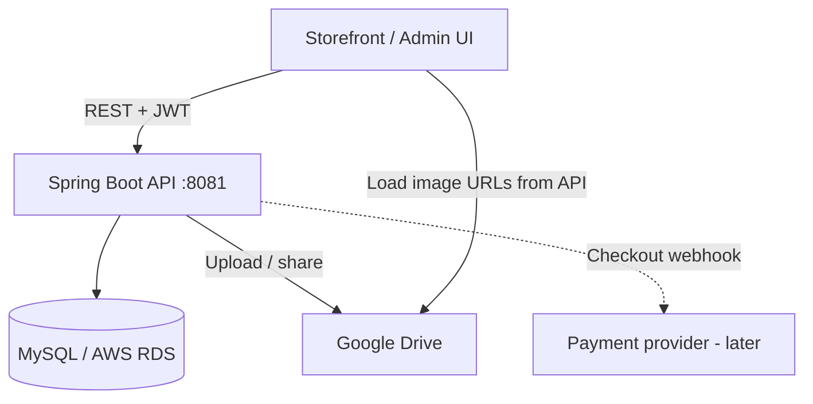

# Full E-Commerce Backend — Step-by-Step Implementation Plan

> **Audience:** Build the complete Nerya All Naturals Spring Boot backend from the current skeleton to a production-capable storefront API.  
> **Source of truth for “today”:** `CURRENT_IMPLEMENTATION_AND_VULNERABILITIES.md`  
> **Location:** `project-docs/` — planning only; does not affect build/runtime.  
> **Stack assumption:** Keep Java 21 + Spring Boot 3.3.4 + MySQL (local or AWS RDS). Images stored in **Google Drive**; **paths/metadata in RDS/MySQL**; APIs return metadata so the UI can render images.

---

## 0. What exists today (baseline)

| Area | Status |
|------|--------|
| JWT login, users, products, categories, inventory | Partial |
| Customer / Address / ProductReview entities | Exist, no APIs |
| Orders, cart, checkout, payments, email | Missing |
| Google Drive / media registry | Missing |
| Flyway migrations, CORS, global errors, tests | Missing / incomplete |
| Critical security bugs (JWT secret, role escalation, IDOR) | Open — must fix before storefront auth |

**Build order principle:** harden foundation → media (Drive + RDS) → customer/auth → catalog polish → cart → orders → payments → reviews → ops.

---

## 1. Target product capabilities

### 1.1 Basic e-commerce (must-have)

1. Public catalog (products, categories, search/filter)
2. Customer registration / login / profile / addresses
3. Cart (add, update qty, remove, clear)
4. Checkout → order creation with inventory reservation
5. Order history + admin order management
6. Inventory as source of truth at purchase time
7. Admin CRUD for catalog, inventory, media, customers/orders
8. CORS + consistent error responses for a separate UI

### 1.2 Custom media feature (your requirement)

```
Admin / process
  │  upload image to Google Drive (or register existing Drive file)
  ▼
Google Drive folder (by category: hero, product, banner, …)
  │
  ▼
RDS/MySQL table `media_assets` (file id, path/URL, category, links)
  │
  ▼
Public APIs → UI fetches metadata → browser loads image URL
```

**Design decision (recommended):**

| Approach | Recommendation |
|----------|----------------|
| Store only Drive links manually in DB | Simple, fragile |
| **Service account uploads + DB metadata** | **Preferred** — admin API uploads multipart file → Drive → save metadata |
| Proxy binary through Spring | Optional later (bandwidth/cost); start with direct Drive public/share URLs |

**Important:** Google Drive is convenient but not a CDN. Use a dedicated Drive folder, service account, and “anyone with link” (or domain-restricted) sharing. Plan to migrate to S3/CloudFront later if traffic grows. For now, implement what you asked for: Drive + RDS path table + fetch APIs.

---

## 2. Target architecture



### Packages to add (keep current layering)

```
.../media/          # Drive client, MediaAsset entity, admin + public APIs
.../cart/
.../order/
.../payment/        # phase later
.../customer/       # or extend existing entity + new services
.../exception/      # global advice
.../db/migration/   # Flyway SQL
```

### Roles

| Role | Use |
|------|-----|
| `ROLE_CUSTOMER` | Shop, cart, checkout, own orders/profile |
| `ROLE_ADMIN` | Catalog, inventory, media upload, all orders |
| `ROLE_USER` | Deprecate or map to internal staff; prefer CUSTOMER for shoppers |

---

## 3. Phase roadmap (overview)

| Phase | Name | Outcome | Depends on |
|-------|------|---------|------------|
| **P0** | Security & foundation | Safe auth, Flyway, CORS, errors, public catalog | — |
| **P1** | Google Drive + RDS media | Upload/register images; UI can list by category | P0 |
| **P2** | Customer identity & profile | Register, profile, addresses | P0 |
| **P3** | Catalog completion | Public catalog polished; product↔media; inventory sync | P0–P1 |
| **P4** | Cart | Persistent or JWT-session cart | P2–P3 |
| **P5** | Orders & checkout | Place order, reserve stock, order APIs | P4 |
| **P6** | Payments (optional MVP) | Mark paid / webhook stub | P5 |
| **P7** | Reviews | Customer reviews on products | P2–P3 |
| **P8** | Hardening & ops | Rate limit, Swagger lock, tests, Docker port, seed data | All |

Each phase below is broken into **concrete tasks** you can execute one-by-one.

---

## 4. Phase P0 — Security & foundation

**Goal:** Fix blockers from the vulnerability doc so new features are not built on a broken auth model.

### Tasks

| ID | Task | Details / acceptance |
|----|------|----------------------|
| P0-T1 | Require JWT secret from env | Remove hardcoded default in `JwtUtil`; fail startup if `JWT_SECRET` missing/short; document in `application.yml` with no real secret |
| P0-T2 | Fix privilege escalation | `PUT /api/users/{id}`: only `ADMIN` may set roles; self-update DTO excludes roles |
| P0-T3 | Fix IDOR | Enforce principal owns resource for non-admin user GETs/PUTs |
| P0-T4 | Move token validate off query string | Prefer `Authorization` header; deprecate `?token=` |
| P0-T5 | Enable Flyway properly | Set `ddl-auto: validate` (or `none`) non-local; add `src/main/resources/db/migration/V1__baseline.sql` matching current schema |
| P0-T6 | Global exception handler | `@ControllerAdvice` + standard `{ code, message, details }` |
| P0-T7 | CORS config | Configurable allowed origins for UI (`CORS_ALLOWED_ORIGINS`) |
| P0-T8 | Public catalog match | `permitAll` for `GET /api/products/**` (non-admin), `GET /api/categories/**` (non-admin) |
| P0-T9 | Align Docker port | `EXPOSE`/`HEALTHCHECK` with `server.port` 8081 (or force 8080 via env) |
| P0-T10 | Profiles | `application-local.yml` / `application-prod.yml` patterns (DB, jwt, swagger enabled flag) |

**Exit criteria:** Admin cannot be self-promoted by a normal user; catalog readable without login; schema owned by Flyway; UI can call API cross-origin.

---

## 5. Phase P1 — Google Drive + RDS media (custom feature)

**Goal:** Store images in Google Drive; store paths/metadata in RDS; APIs so UI can display images by category.

### 5.1 Google Cloud setup (ops tasks — outside code)

| ID | Task | Details |
|----|------|---------|
| P1-T1 | Create GCP project + enable Drive API | Google Cloud Console |
| P1-T2 | Create service account | Download JSON key; **never commit**; load via env/`GOOGLE_APPLICATION_CREDENTIALS` or base64 secret |
| P1-T3 | Create Drive folder structure | e.g. `nerya/media/hero`, `nerya/media/product`, `nerya/media/banner`, `nerya/media/category` |
| P1-T4 | Share folders with service account | Editor on parent folder |
| P1-T5 | Decide sharing model | Recommended: after upload, set permission `anyone` + `reader` for website display (or use signed/proxy later) |

### 5.2 Database (RDS / MySQL)

| ID | Task | Details |
|----|------|---------|
| P1-T6 | Flyway `V2__media_assets.sql` | Create table (see schema below) |
| P1-T7 | Entity + repository | `MediaAsset`, `MediaAssetRepository` |
| P1-T8 | Optional link to product | `product_id` nullable FK — product gallery images |

**Suggested table `media_assets`:**

| Column | Type | Purpose |
|--------|------|---------|
| `id` | BIGINT PK | Surrogate key |
| `drive_file_id` | VARCHAR(128) UNIQUE | Google Drive file id |
| `file_name` | VARCHAR(255) | Original name |
| `mime_type` | VARCHAR(100) | image/jpeg, image/png, webp |
| `category` | VARCHAR(50) | `HERO`, `BANNER`, `PRODUCT`, `CATEGORY`, `GALLERY`, … |
| `folder_path` | VARCHAR(512) | Logical path e.g. `nerya/media/product` |
| `web_view_link` | VARCHAR(1024) | Drive view URL |
| `web_content_link` | VARCHAR(1024) | Direct content URL if available |
| `thumbnail_link` | VARCHAR(1024) | Optional |
| `public_url` | VARCHAR(1024) | Canonical URL UI should use |
| `alt_text` | VARCHAR(255) | Accessibility |
| `sort_order` | INT | Display order within category |
| `product_id` | BIGINT NULL | FK products |
| `is_active` | BOOLEAN | Soft hide |
| `created_at` / `updated_at` | TIMESTAMP | Audit |

### 5.3 Google Drive integration (code)

| ID | Task | Details / acceptance |
|----|------|----------------------|
| P1-T9 | Add Drive dependency | Google API Client + Drive v3 for Java |
| P1-T10 | `GoogleDriveConfig` | Load service account; build `Drive` bean |
| P1-T11 | `GoogleDriveService` | `upload(file, folderId, mime)`, `setPublicReader(fileId)`, `delete(fileId)`, `getMetadata(fileId)` |
| P1-T12 | Map category → folder id | Config map in yml: `media.drive.folders.HERO=...` etc. |
| P1-T13 | `MediaService` | Orchestrate upload → permissions → persist `MediaAsset` |
| P1-T14 | Admin upload API | `POST /api/media/admin/upload` multipart (`file`, `category`, `altText`, optional `productId`) → returns saved metadata |
| P1-T15 | Admin register-by-id API | `POST /api/media/admin/register` for files already in Drive (path + file id) |
| P1-T16 | Admin update / soft-delete | `PUT /api/media/admin/{id}`, `DELETE /api/media/admin/{id}` |
| P1-T17 | **Public fetch APIs** | See below — UI-facing |
| P1-T18 | Security rules | Admin mutations `@AdminOnly`; GETs `permitAll` |
| P1-T19 | Wire product images | Prefer `media_assets.product_id` over free-text URLs on `ProductImage` (migrate or dual-support) |

**Public fetch APIs (UI):**

| Method | Path | Behavior |
|--------|------|----------|
| GET | `/api/media` | List active; filter `?category=HERO&productId=` |
| GET | `/api/media/{id}` | Single asset metadata |
| GET | `/api/media/category/{category}` | All active in category, ordered by `sort_order` |
| GET | `/api/media/product/{productId}` | Product gallery |

Response DTO example:

```json
{
  "id": 12,
  "category": "HERO",
  "publicUrl": "https://drive.google.com/uc?export=view&id=FILE_ID",
  "altText": "Nerya hero",
  "sortOrder": 1,
  "productId": null
}
```

**Exit criteria:** Admin can upload an image to Drive; row appears in RDS; UI can call public GET by category and render `publicUrl`.

---

## 6. Phase P2 — Customer identity & profile

**Goal:** Shoppers can register and manage profile/addresses using existing `Customer` / `Address` entities.

### Tasks

| ID | Task | Details / acceptance |
|----|------|----------------------|
| P2-T1 | Registration API | `POST /api/auth/register` → create `User` (`ROLE_CUSTOMER`) + linked `Customer` |
| P2-T2 | Login returns roles + customerId | Extend `AuthResponse` |
| P2-T3 | Profile APIs | `GET/PUT /api/customers/me` (owner only) |
| P2-T4 | Address CRUD | `GET/POST/PUT/DELETE /api/customers/me/addresses` |
| P2-T5 | Fix JPA associations | `Address` ↔ `Customer` proper `@ManyToOne` / `@OneToMany` |
| P2-T6 | Route `UserController` through `UserService` | Stop bypassing service layer |
| P2-T7 | Seed first admin | Flyway or secure bootstrap script (document process) |

**Exit criteria:** New customer registers, logs in, adds address; cannot see other customers’ data.

---

## 7. Phase P3 — Catalog completion

**Goal:** Storefront-ready catalog; stock consistency; media attached to products/categories.

### Tasks

| ID | Task | Details |
|----|------|---------|
| P3-T1 | Category update/delete (admin) | Soft-delete preferred |
| P3-T2 | Product search/filter | `q`, `categoryId`, `minPrice`, `maxPrice`, `inStock`, pagination |
| P3-T3 | Unify stock | Treat `Inventory` as source of truth; sync `Product.inStock` / derived qty on inventory change |
| P3-T4 | Auto-create inventory on product create | Default zero or request qty |
| P3-T5 | Attach media to category | Optional `category_id` on `media_assets` or category thumbnail media id |
| P3-T6 | Public product DTO includes image URLs | From `media_assets` (and legacy `ProductImage` if kept) |
| P3-T7 | Pagination standard | Spring `Page` / size-limited defaults |

**Exit criteria:** Guest can browse/search products with images; stock numbers consistent between product list and inventory.

---

## 8. Phase P4 — Cart

**Goal:** Authenticated customers can maintain a cart.

### Suggested model

- `carts` (id, customer_id unique)
- `cart_items` (cart_id, product_id, quantity)

### Tasks

| ID | Task | Details |
|----|------|---------|
| P4-T1 | Flyway cart tables | V3 migration |
| P4-T2 | Cart entity/repo/service | |
| P4-T3 | APIs | `GET /api/cart`, `POST /api/cart/items`, `PUT /api/cart/items/{productId}`, `DELETE ...`, `DELETE /api/cart` |
| P4-T4 | Validate stock on add/update | Compare to `Inventory.quantityOnHand - reserved` |
| P4-T5 | Authz | `@CustomerOnly` (or authenticated customer) |

**Exit criteria:** Customer adds products, updates qty, sees totals; overselling attempted qty rejected.

---

## 9. Phase P5 — Orders & checkout

**Goal:** Convert cart to order; reserve inventory; track status.

### Suggested model

- `orders` (id, customer_id, status, totals, shipping address snapshot, payment_status, …)
- `order_items` (order_id, product_id, sku, name snapshot, unit_price, qty, line_total)
- Status enum: `PENDING` → `CONFIRMED` → `PACKED` → `SHIPPED` → `DELIVERED` / `CANCELLED`

### Tasks

| ID | Task | Details |
|----|------|---------|
| P5-T1 | Flyway order tables | V4 |
| P5-T2 | Checkout service (transactional) | Validate cart → reserve inventory → create order → clear cart |
| P5-T3 | Customer APIs | `POST /api/orders/checkout`, `GET /api/orders/me`, `GET /api/orders/me/{id}`, `POST .../cancel` (if allowed) |
| P5-T4 | Admin order APIs | List/filter, get, update status |
| P5-T5 | Inventory reservation logic | Increment `reserved` on checkout; on cancel/ship adjust on-hand/sold |
| P5-T6 | Address snapshot | Copy shipping fields onto order so later address edits don’t rewrite history |
| P5-T7 | Idempotency key (optional) | Header to prevent double checkout |

**Exit criteria:** Full happy path from cart → order with stock reserved; admin can advance status.

---

## 10. Phase P6 — Payments (MVP)

**Goal:** Enough to mark orders paid; integrate real provider when ready.

### Tasks

| ID | Task | Details |
|----|------|---------|
| P6-T1 | Choose provider | Razorpay (India) or Stripe — decide by market |
| P6-T2 | `payments` table | provider, provider_ref, amount, status, order_id |
| P6-T3 | Create payment intent API | Admin/customer starts payment for order |
| P6-T4 | Webhook endpoint | Verify signature; set order `PAID` / `FAILED` |
| P6-T5 | COD option (optional) | `paymentMethod=COD` → confirm without gateway |

**Exit criteria:** At least one path: COD **or** one gateway sandbox payment flips order to paid.

---

## 11. Phase P7 — Reviews

### Tasks

| ID | Task | Details |
|----|------|---------|
| P7-T1 | Complete `ProductReview` associations | Customer + Product FKs |
| P7-T2 | APIs | Public list by product; customer create/update own; admin moderate/delete |
| P7-T3 | Optional rule | Only customers with delivered order can review |

---

## 12. Phase P8 — Hardening, tests, ops

| ID | Task |
|----|------|
| P8-T1 | Rate-limit login (Bucket4j / filter / gateway) |
| P8-T2 | Disable or protect Swagger in prod |
| P8-T3 | Integration tests: media public GET, cart, checkout stock, authz IDOR |
| P8-T4 | Actuator stays limited; health for deploy |
| P8-T5 | Update `CURRENT_IMPLEMENTATION_AND_VULNERABILITIES.md` after each phase |
| P8-T6 | README: env vars (`JWT_SECRET`, DB_*, Drive folder ids, CORS) |
| P8-T7 | Seed demo products + sample Drive-linked media (dev only) |

---

## 13. Recommended execution order (week-style sequence)

Use this if you want a linear checklist:

1. **P0-T1 → P0-T10** — foundation & security  
2. **P1-T1 → P1-T5** — GCP/Drive ops setup  
3. **P1-T6 → P1-T19** — media table + Drive upload + fetch APIs ← *your distinctive feature early so UI work can start*  
4. **P2** — customer register/profile/addresses  
5. **P3** — catalog search + stock unify + product images from media  
6. **P4** — cart  
7. **P5** — checkout/orders  
8. **P6** — payments MVP  
9. **P7** — reviews  
10. **P8** — harden & document  

Doing **media (P1) before cart/orders** is intentional: the UI can show a real storefront while commerce flows are still being built.

---

## 14. API surface (target — condensed)

### Public

- `POST /api/auth/login`, `POST /api/auth/register`
- `GET /api/products…`, `GET /api/categories…`
- `GET /api/media…`, `GET /api/media/category/{category}`
- Health endpoints

### Customer

- `/api/customers/me`, `/api/customers/me/addresses`
- `/api/cart…`
- `/api/orders…`

### Admin

- Existing product/category/inventory/user admin routes (hardened)
- `/api/media/admin/upload|register|{id}`
- `/api/orders/admin…`

---

## 15. Config keys to introduce

```yaml
jwt:
  secret: ${JWT_SECRET}          # required
  expiration: ${JWT_EXPIRATION:86400000}

cors:
  allowed-origins: ${CORS_ALLOWED_ORIGINS:http://localhost:3000}

media:
  google:
    credentials-json: ${GOOGLE_DRIVE_CREDENTIALS_JSON:}  # or file path
    folders:
      HERO: ${DRIVE_FOLDER_HERO}
      BANNER: ${DRIVE_FOLDER_BANNER}
      PRODUCT: ${DRIVE_FOLDER_PRODUCT}
      CATEGORY: ${DRIVE_FOLDER_CATEGORY}
```

RDS: reuse existing datasource props pointing at AWS RDS endpoint (`DB_HOST`, `DB_PORT`, `DB_NAME`, `DB_USERNAME`, `DB_PASSWORD`).

---

## 16. Risks & mitigations

| Risk | Mitigation |
|------|------------|
| Drive rate limits / link expiry / hotlinking | Cache metadata; stable `uc?export=view&id=` URLs; later S3 |
| Service account key leak | Secrets manager / env only; rotate if exposed |
| Overselling | DB transaction + reserved qty on checkout |
| Building features on broken auth | Complete P0 first |
| Scope creep | Ship P0+P1+P2+P4+P5 before payments/reviews polish |

---

## 17. Definition of “full functional backend” for this project

You can call the backend **feature-complete for an MVP storefront** when:

- [ ] Security P0 fixes merged  
- [ ] Admin uploads images to Google Drive and rows exist in RDS  
- [ ] UI can fetch images by category via API  
- [ ] Guest browses catalog with images  
- [ ] Customer registers, carts, checks out  
- [ ] Admin manages orders and inventory without stock drift  
- [ ] Flyway owns schema on RDS  

Payments and reviews can follow as v1.1.

---

## 18. Next action

When you are ready to implement, start with **Phase P0 (security + Flyway + CORS + public catalog)**, then **Phase P1 (Drive + `media_assets` + fetch APIs)**.

Say which phase to implement first if you want coding to begin (recommended: **P0**, then **P1**).

---

*End of plan.*
